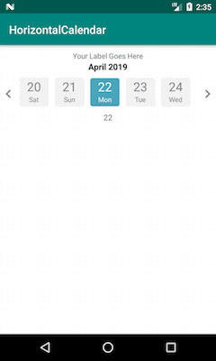

[  ](https://bintray.com/sahanab/HorizontalCalendarView/HorizontalCalendarView/_latestVersion) [  ](https://bintray.com/sahanab/HorizontalCalendarView/HorizontalCalendarView/0.11/link)
# HorizontalCalendarSample
HorizontalCalendarSample is an Android library for creating horizontal view for Calendar


# Features
- Customizable text color and size ,background color,number of days to display.
- minSdkVersion 14

## Installation

Latest version of the library can be found on Maven Central.

# For Gradle users
Open your ```build.gradle``` Then, include the library as dependency:

```    
implementation 'com.android.support:recyclerview-v7:28.0.0'
implementation 'com.sahana.horizontalcalendarview:HorizontalCalendarView:0.11'
```

# For Maven users
Add this dependency to your ```pom.xml```:
```
<dependency>
  <groupId>com.sahana.horizontalcalendarview</groupId>
  <artifactId>HorizontalCalendarView</artifactId>
  <version>0.11</version>
  <type>pom</type>
</dependency>
```
## Usage

Please see the ```/HorizontalCalendarSample-app``` app for a more detailed code example of how to use the library.

1.Add the ```HorizontalCalendar``` view to the layout you want to show.
```
<com.sahana.horizontalcalendarview.CustomHorizontalCalendar
        android:id="@+id/customHorizontal"
        android:layout_width="match_parent"
        android:layout_height="wrap_content"
        android:layout_alignParentTop="true"
        android:layout_marginTop="30dp"
        app:numOfDays="90"
        app:setLabel="@string/label" />
 ```      
2.Configure attributes.
- ```numOfDays``` - to set number of days to display in horizontal calendar (default: 60 days).

- ```setLabel``` - to set your title/label to view.

- ```setBgColor``` - to set backgroundcolor when user not selected  (default: light gray (#f2f2f2) ).

- ```setTextColor``` - to set text color when user not selected (default: drak gray (#FF858585) ).

- ```setSelectedBgColor``` - to set backgroundcolor when user selected (default: sky blue (#4ba6bb) ).

- ```setSelectedTextColor``` - to set text color when user selected (default: white ).

- ```setScrollSpeed``` - to set scroll speed of view when pressed for long on arrow marks\icons (default: 30).
     - If you want scroll speed to be slow then set the ```setScrollSpeed``` value below 30 (only postive Integers allowed).
     
- ```setMonthColor``` - to set ```Month and Year``` text color (default: black).

- ```setLabelTextSize``` - to set title/label text size in SP (default: 13sp) .

- ```setMonthTextSize``` - to ```Month and Year``` text size in SP (default: 15sp) .

- ```setLabelFontStyle``` - to set title/label font(typeface).

- ```setMonthFontStyle``` - to ```Month and Year``` font(typeface).

3.To listen to date events you need to set a listener:
- ```setOnDateSelectListener``` - by calling this.
```
        mCustomHorizontalCalendar.setOnDateSelectListener(new OnHorizontalDateSelectListener() {
            @Override
            public void onDateClick(DateModel dateModel) {
                Log.d("date", dateModel != null ? dateModel.month + dateModel.day + dateModel.dayOfWeek + dateModel.year : "");

            }
        });
```

4. If you want to set label dynamically  call below method:
- ```setLabel(String labelName)```

 ```mCustomHorizontalCalendar.setLabel("Your Label Name");```
